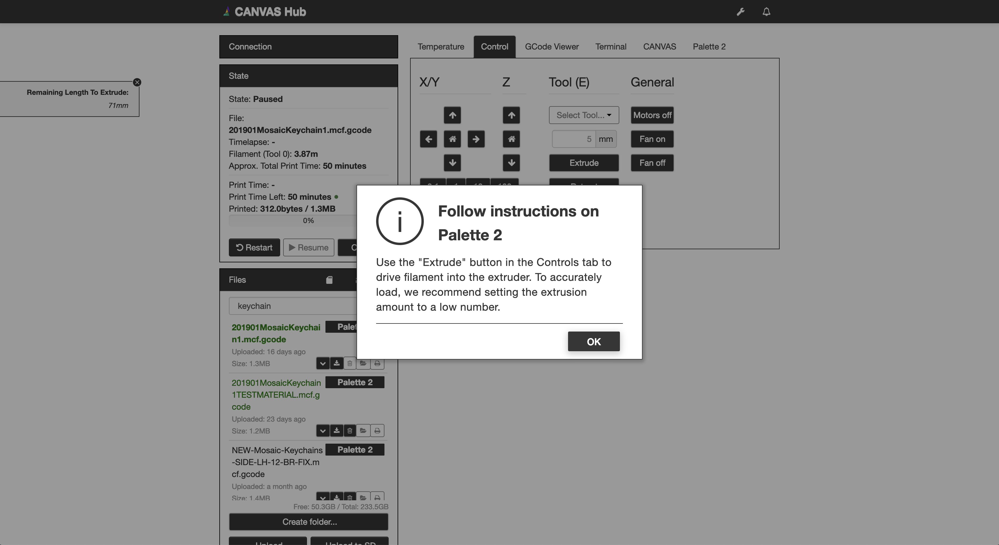
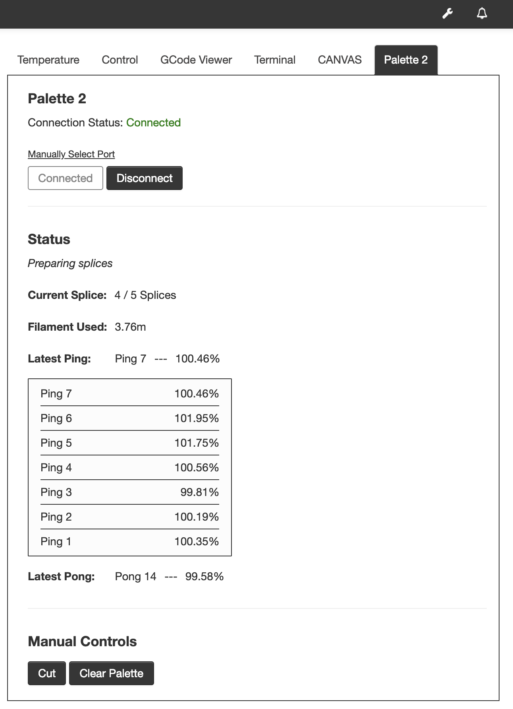
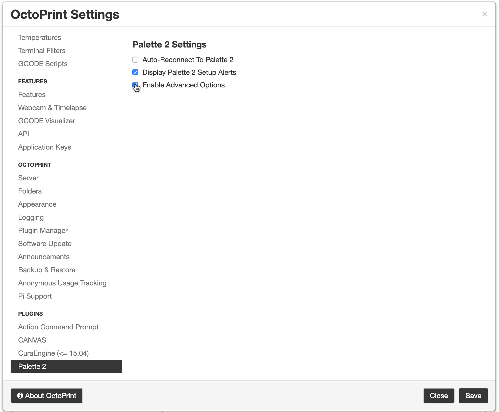
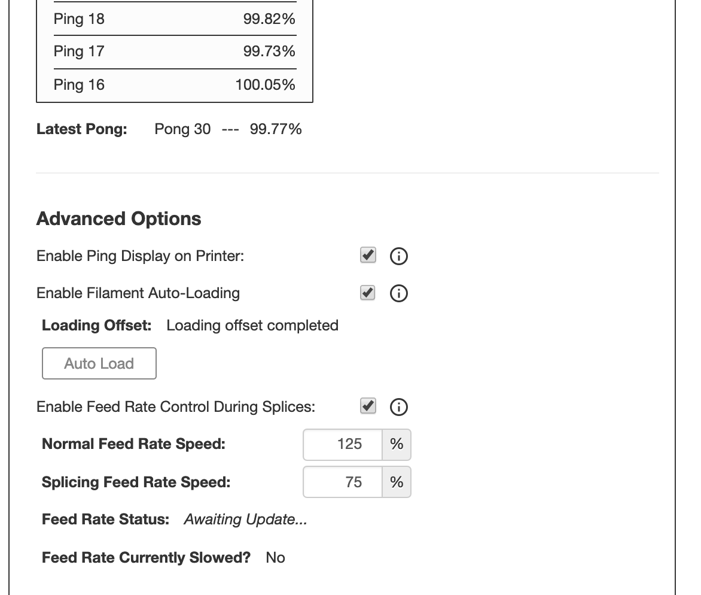

# PALETTE 2 PLUGIN

This OctoPrint plugin enables connection and communication between OctoPrint and your [Palette 2](https://www.mosaicmfg.com/products/palette-2).

## Installing

On your OctoPrint server, manually install this plugin via the Plugin Manager using the following URL:

`https://gitlab.com/mosaic-mfg/palette-2-plugin/-/archive/master/palette-2-plugin-master.zip`

## Functionalities

### 1. Connect your Palette 2 to OctoPrint

### 2. Start your Palette 2 Print and follow instructions on screen

### 3. Keep track of your Palette 2 splicing status

### 4. Optionally, enable advanced options to enhance your print...

### 4.1. ... And control your feed rate, ping display on printers and auto-loading

## Authors

[Mosaic Manufacturing Ltd.](https://www.mosaicmfg.com/)

[Tim Brookman](https://gitlab.com/skellatore) - Minor Modifications

## License

This project is licensed under Creative Commons Public Licenses - see the [LICENSE](https://gitlab.com/mosaic-mfg/canvas-plugin/blob/master/LICENSE) file for more details.
